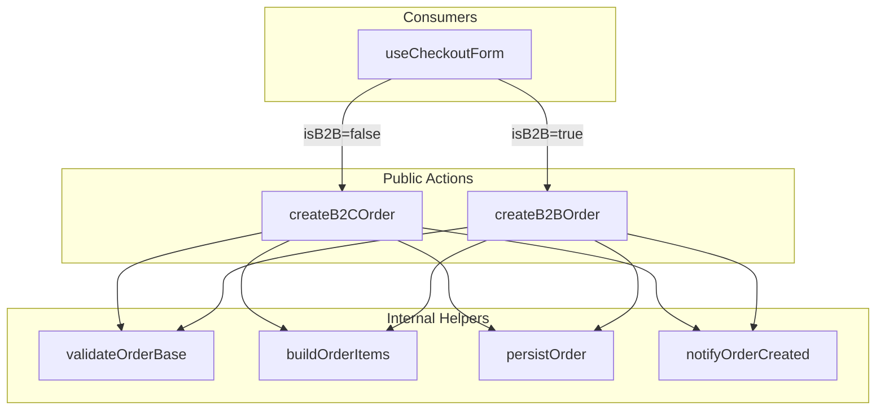

# B2B/B2C Order Separation

## Architecture



## File Structure

```
src/features/orders/
├── actions.ts              # Public exports (createB2COrder, createB2BOrder, admin actions)
├── actions/
│   ├── create-b2c-order.ts # B2C order creation (guests + auth without org)
│   ├── create-b2b-order.ts # B2B order creation (requires org membership)
│   └── internal.ts         # Shared helpers (not exported publicly)
├── queries.ts              # Unchanged
```

## Implementation

### 1. Create internal helpers module

[`src/features/orders/actions/internal.ts`](src/features/orders/actions/internal.ts)

Extract from current [`actions.ts`](src/features/orders/actions.ts):

- `OrderItemData` type
- `buildOrderItems()` - already extracted, keep as-is
- `validateStoreExists()` - new helper
- `validateCart()` - new helper  
- `persistOrder()` - new helper for DB insert + status event
- `notifyOrderCreated()` - sends `newOrder` + `receipt` emails

### 2. Create B2C order action

[`src/features/orders/actions/create-b2c-order.ts`](src/features/orders/actions/create-b2c-order.ts)

```typescript
export async function createB2COrder(data: {
  storeId: string;
  pickupDate: string;
  pickupTime: string;
  paymentMethod: Exclude<PaymentMethod, "invoice">;
  customerInfo: GuestCustomerInfo;
}): Promise<CreateOrderResult>
```

- Validates `orders_enabled` site config
- Validates customer info
- Rejects `invoice` payment method (B2C only: `in_store`, `card`)
- Calls shared helpers for cart, store, persist, notify
- Handles guest last-order cookie + profile update side effects

### 3. Create B2B order action

[`src/features/orders/actions/create-b2b-order.ts`](src/features/orders/actions/create-b2b-order.ts)

```typescript
export async function createB2BOrder(data: {
  storeId: string;
  pickupDate: string;
  pickupTime: string;
  paymentMethod: PaymentMethod;
  customerInfo: GuestCustomerInfo;
}): Promise<CreateOrderResult>
```

- Requires B2B membership via `requireB2bMember()` guard
- Applies tier pricing via `priceTierId`
- Sets `companyId` on order
- Allows `invoice` payment method
- Future: auto-generate invoice, PO number support

### 4. Update checkout hook

[`src/features/checkout/hooks/use-checkout-form.ts`](src/features/checkout/hooks/use-checkout-form.ts)

Add `isB2B` prop and call appropriate action:

```typescript
const result = isB2B
  ? await createB2BOrder({ ... })
  : await createB2COrder({ ... });
```

### 5. Re-export from main actions.ts

[`src/features/orders/actions.ts`](src/features/orders/actions.ts)

```typescript
export { createB2COrder } from "./actions/create-b2c-order";
export { createB2BOrder } from "./actions/create-b2b-order";
// Keep admin actions in main file
```

## Key Decisions

- **No breaking changes**: existing `createOrderFromCart` can be deprecated but kept temporarily
- **Shared helpers are internal**: not exported from feature, prevents coupling
- **Type-safe payment methods**: B2C rejects invoice at type level
- **Guards at entry point**: B2B action uses `requireB2bMember()`, B2C allows guests

## Future B2B Extensions (enabled by this separation)

- Invoice auto-generation on order creation
- PO number field support
- Credit limit checking
- Different email templates (B2B order confirmation vs receipt)
- Delivery scheduling (vs pickup only)