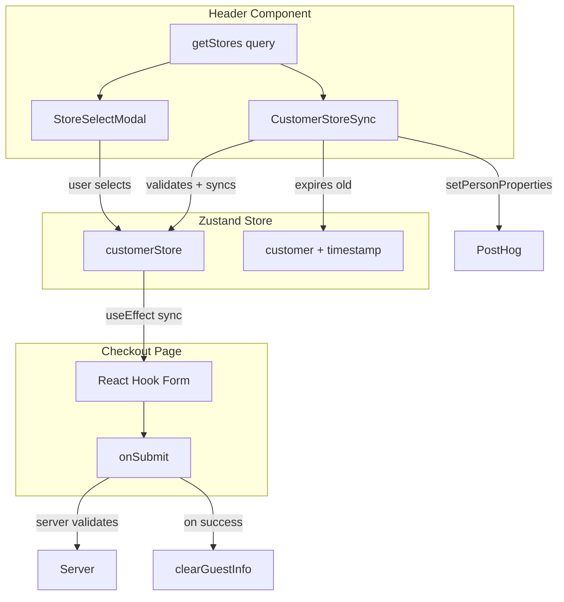

# Checkout Store Sync & Validation Fixes

## Problem Summary

Three issues in the checkout flow:

1. **RHF not syncing with Zustand store changes** - If user changes store via global modal during checkout, form's `storeId` doesn't update (RHF `defaultValues` only used on mount)
2. **Invalid storeId not validated** - Persisted store ID might reference a deleted store; neither client nor server validates existence before order creation
3. **Guest PII persisted indefinitely** - Email/phone stored in localStorage with no expiration (GDPR concern)

---

## Revised Architecture: Centralized CustomerStoreSync

Following the existing `AuthIdentitySync` pattern, we create a **`CustomerStoreSync`** component that handles all sync/validation logic in one place:

```
header.tsx
├── StoreSelectModal      # user selects store → Zustand
├── CustomerStoreSync     # validates/syncs Zustand ↔ auth + PostHog
```

This is cleaner than scattering logic across checkout hooks.

---

## Fix 1: Create CustomerStoreSync Component

**New File:** `src/components/customer-store-sync.tsx`

Headless component that:

1. **Syncs auth user's storeId to Zustand** when logged in
2. **Validates persisted storeId** against available stores (clears if invalid)
3. **Checks guest info expiration** (clears if older than 30 days)
4. **Syncs store selection to PostHog** as person property
```typescript
"use client";

import posthog from "posthog-js";
import { use, useEffect, useRef } from "react";
import type { Store } from "@/features/stores/queries";
import { useSession } from "@/lib/auth/client";
import { useConsent } from "@/hooks/use-consent";
import {
  useCustomerActions,
  useCustomerData,
  useGuestInfoSavedAt,
  useSelectedStore,
} from "@/store/customer-store";

const GUEST_INFO_EXPIRY_DAYS = 30;

type Props = {
  storesPromise: Promise<Store[]>;
};

/**
 * Syncs customer store state with auth user and validates persisted data.
 * Similar pattern to AuthIdentitySync.
 */
export function CustomerStoreSync({ storesPromise }: Props) {
  const stores = use(storesPromise);
  const { data: session, isPending } = useSession();
  const { analytics } = useConsent();

  const customer = useCustomerData();
  const customerStore = useSelectedStore();
  const guestInfoSavedAt = useGuestInfoSavedAt();
  const { setCustomerStore, clearGuestInfo, clearStaleStore } = useCustomerActions();

  const lastSyncedStoreId = useRef<string | null>(null);

  useEffect(() => {
    if (isPending) return;

    const user = session?.user;
    const storeIds = new Set(stores.map((s) => s.id));

    // 1. Validate persisted store - clear if deleted
    if (customerStore?.id && !storeIds.has(customerStore.id)) {
      clearStaleStore();
    }

    // 2. Sync auth user's storeId to Zustand (if user has one and it's valid)
    if (user?.storeId && storeIds.has(user.storeId)) {
      const userStore = stores.find((s) => s.id === user.storeId);
      if (userStore && customerStore?.id !== user.storeId) {
        setCustomerStore({ id: userStore.id, name: userStore.name });
      }
    }

    // 3. Expire old guest info (privacy)
    if (!user && guestInfoSavedAt) {
      const expiryMs = GUEST_INFO_EXPIRY_DAYS * 24 * 60 * 60 * 1000;
      if (Date.now() - guestInfoSavedAt > expiryMs) {
        clearGuestInfo();
      }
    }

    // 4. Sync store to PostHog (for analytics segmentation)
    if (analytics && customerStore?.id && customerStore.id !== lastSyncedStoreId.current) {
      posthog.setPersonProperties({ 
        store_id: customerStore.id, 
        store_name: customerStore.name 
      });
      lastSyncedStoreId.current = customerStore.id;
    }
  }, [isPending, session, stores, customerStore, guestInfoSavedAt, analytics, 
      setCustomerStore, clearGuestInfo, clearStaleStore]);

  return null;
}
```


---

## Fix 2: Update Customer Store

**File:** `src/store/customer-store.ts`

Add timestamp tracking and new actions:

```typescript
type CustomerState = {
  customer: Customer;
  customerStore: SelectedStore;
  guestInfoSavedAt: number | null; // NEW: timestamp for expiration
};

type CustomerActions = {
  setCustomer: (customer: Customer) => void;
  setCustomerStore: (customerStore: SelectedStore) => void;
  clearGuestInfo: () => void;    // NEW: clear guest PII
  clearStaleStore: () => void;   // NEW: clear invalid store
};
```

Key changes:

- `setCustomer` records timestamp: `guestInfoSavedAt: customer ? Date.now() : null`
- New `clearGuestInfo()` clears customer + timestamp
- New `clearStaleStore()` clears only customerStore
- New `useGuestInfoSavedAt` selector export

Add dev-only sanity check at end of file:

```typescript
// Development sanity check - validates store shape
if (process.env.NODE_ENV === "development") {
  const testStore = createCustomerStore.getState();
  console.assert(testStore.actions.setCustomer !== undefined, "setCustomer missing");
  console.assert(testStore.actions.setCustomerStore !== undefined, "setCustomerStore missing");
  console.assert(testStore.actions.clearGuestInfo !== undefined, "clearGuestInfo missing");
  console.assert(testStore.actions.clearStaleStore !== undefined, "clearStaleStore missing");
}
```

---

## Fix 3: Integrate Sync Component

**File:** `src/app/(public)/_components/header.tsx`

Add `CustomerStoreSync` where stores are already fetched:

```typescript
import { CustomerStoreSync } from "@/components/customer-store-sync";

export function Header() {
  const stores = getStores();
  return (
    <header>
      {/* ... existing content ... */}
      <Suspense>
        <StoreSelectModal storesPromise={stores} />
      </Suspense>
      
      {/* NEW: Sync component */}
      <Suspense fallback={null}>
        <CustomerStoreSync storesPromise={stores} />
      </Suspense>
    </header>
  );
}
```

---

## Fix 4: Simplify Checkout Form Hook

**File:** `src/features/checkout/hooks/use-checkout-form.ts`

With `CustomerStoreSync` handling validation upstream, the checkout hook needs:

1. **Add effect to sync Zustand → RHF** when external store changes (user selects via global modal)
2. **Clear guest info on success** (call `clearGuestInfo` after order)
```typescript
// Add to props: clearGuestInfo from useCustomerActions

// NEW Effect: Sync external store selection (from global modal) to form
useEffect(() => {
  const externalStoreId = customerStore?.id;
  const currentFormStoreId = form.getValues("storeId");
  
  // Sync if Zustand store changed and differs from form
  if (externalStoreId && externalStoreId !== currentFormStoreId) {
    form.setValue("storeId", externalStoreId, { shouldValidate: true });
  }
}, [customerStore?.id, form]);

// In onSubmit, after success:
if (result.success) {
  if (isGuest) {
    clearGuestInfo(); // Clear PII after order (privacy)
  }
  toast.success("Vaša objednávka bola vytvorená");
  router.push(`/pokladna/${result.orderId}` as Route);
}
```


---

## Fix 5: Server-Side Validation (Defense in Depth)

**File:** `src/features/orders/actions.ts`

Still needed as final validation layer:

```typescript
// After cart validation, before order creation (~line 75)
const storeExists = await db.query.stores.findFirst({
  where: eq(stores.id, data.storeId),
  columns: { id: true },
});

if (!storeExists) {
  return { success: false, error: "Vybraná predajňa neexistuje" };
}
```

---

## Documentation Updates

**File:** `docs/features/checkout.md`

Add new section:

```markdown
### Customer Store Sync

The `CustomerStoreSync` component (in header) handles:
- **Auth user sync**: User's preferred store synced to Zustand on login
- **Store validation**: Clears localStorage if persisted store was deleted
- **Guest expiration**: Guest info expires after 30 days
- **PostHog sync**: Store selection tracked as person property

### Guest Data Retention
- Stored in localStorage with timestamp
- **Cleared automatically** after successful order
- **Expires** after 30 days of inactivity
```

**File:** `docs/features/checkout-changelog.md`

Add new entry documenting the architectural change.

---

## Data Flow Diagram



---

## Files to Modify/Create

| File | Action | Changes |

|------|--------|---------|

| `src/components/customer-store-sync.tsx` | **CREATE** | New sync component |

| `src/store/customer-store.ts` | MODIFY | Add timestamp, new actions, new selector |

| `src/app/(public)/_components/header.tsx` | MODIFY | Add CustomerStoreSync |

| `src/features/checkout/hooks/use-checkout-form.ts` | MODIFY | Zustand→RHF sync, clearGuestInfo on success |

| `src/features/orders/actions.ts` | MODIFY | Server-side storeId validation |

| `docs/features/checkout.md` | MODIFY | Document new architecture |

| `docs/features/checkout-changelog.md` | MODIFY | Add changelog entry |