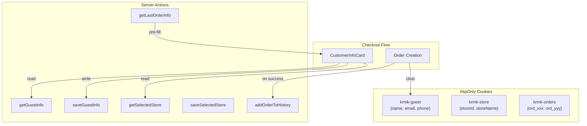

# Guest Data Cookie Migration

## Current State

- Guest PII (name, email, phone) stored in localStorage via Zustand (`src/store/customer-store.ts`)
- Vulnerable to XSS attacks (any JS can read localStorage)
- Cart already uses secure httpOnly cookies (`src/features/cart/cookies.ts`)

## Target Architecture



## Implementation

### Phase 1: Cookie Infrastructure

Create `src/features/checkout/cookies.ts` with:

- `getGuestInfo()` / `setGuestInfo()` / `clearGuestInfo()` - guest PII cookie (30-day expiry)
- `getSelectedStore()` / `setSelectedStore()` / `clearSelectedStore()` - store selection cookie
- `getOrderHistory()` / `addOrderToHistory()` - order IDs cookie (max 10 orders)

Pattern to follow from [src/features/cart/cookies.ts](src/features/cart/cookies.ts):

```ts
export async function setGuestInfo(info: GuestInfo): Promise<void> {
  (await cookies()).set(GUEST_INFO_COOKIE, JSON.stringify(info), {
    httpOnly: true,
    secure: process.env.NODE_ENV === "production",
    sameSite: "lax",
    maxAge: MAX_AGE,
    path: "/",
  });
}
```

### Phase 2: Server Actions

Create `src/features/checkout/actions.ts` with:

- `saveGuestInfoAction(info)` - saves guest info to cookie
- `saveSelectedStoreAction(store)` - saves store selection
- `getLastOrderInfoAction()` - fetches customerInfo from most recent order in history

The `getLastOrderInfoAction` query:

```ts
// Get order IDs from cookie, fetch most recent order's customerInfo
const history = await getOrderHistory();
if (history.length === 0) return null;

const order = await db.query.orders.findFirst({
  where: inArray(orders.id, history),
  orderBy: [desc(orders.createdAt)],
  columns: { customerInfo: true, storeId: true },
});
return order?.customerInfo ?? null;
```

### Phase 3: Update Checkout Components

**[src/features/checkout/components/customer-info-card.tsx](src/features/checkout/components/customer-info-card.tsx)**

- Remove Zustand imports (`useCustomerData`, `useCustomerActions`)
- Accept `guestInfo` and `lastOrderInfo` as props (fetched server-side)
- Call `saveGuestInfoAction` on form changes (debounced) instead of `setCustomer`

**[src/features/checkout/hooks/use-checkout-form.ts](src/features/checkout/hooks/use-checkout-form.ts)**

- Remove `clearGuestInfo` prop
- On successful order: call `addOrderToHistory(orderId)` then `clearGuestInfo()`

**Checkout page** (`src/app/(public)/pokladna/page.tsx`):

- Fetch `guestInfo` and `selectedStore` from cookies server-side
- Fetch `lastOrderInfo` for pre-fill if no guest info exists
- Pass as props to form components

### Phase 4: Update Order Creation

In [src/features/orders/actions.ts](src/features/orders/actions.ts) `createOrderFromCart`:

- After successful order insert, call `addOrderToHistory(order.id)`
- Call `clearGuestInfo()` to remove PII from cookie

### Phase 5: Remove Old Infrastructure

- Delete or gut `src/store/customer-store.ts` (keep only if store selection needs client-side reactivity)
- Simplify `src/components/customer-store-sync.tsx` - remove guest info logic, keep PostHog sync if needed
- Update imports across codebase

### Phase 6: Documentation

Update [docs/features/checkout.md](docs/features/checkout.md):

- Document new cookie-based architecture
- Remove localStorage/Zustand references
- Document order history feature
- Add security rationale

## Cookie Structure

| Cookie | Content | Max Age | Cleared |

|--------|---------|---------|---------|

| `krmk-guest` | `{name, email, phone}` | 30 days | After order |

| `krmk-store` | `{storeId, storeName}` | 30 days | Never (persists) |

| `krmk-orders` | `["ord_xxx", ...]` | 365 days | Never (max 10) |

## Files Changed

**New files:**

- `src/features/checkout/cookies.ts`
- `src/features/checkout/actions.ts`

**Modified files:**

- `src/features/checkout/components/customer-info-card.tsx`
- `src/features/checkout/hooks/use-checkout-form.ts`
- `src/features/orders/actions.ts`
- `src/app/(public)/pokladna/page.tsx`
- `src/components/customer-store-sync.tsx`
- `docs/features/checkout.md`

**Potentially removed:**

- `src/store/customer-store.ts` (or heavily simplified)

## Future: Repeat Order Feature

With order history in place, adding "repeat order" to cart sheet is straightforward:

- Read `krmk-orders` cookie
- Fetch last order's items
- Show "Repeat last order?" button
- Add items to cart on click

This is out of scope for initial implementation but the infrastructure enables it.