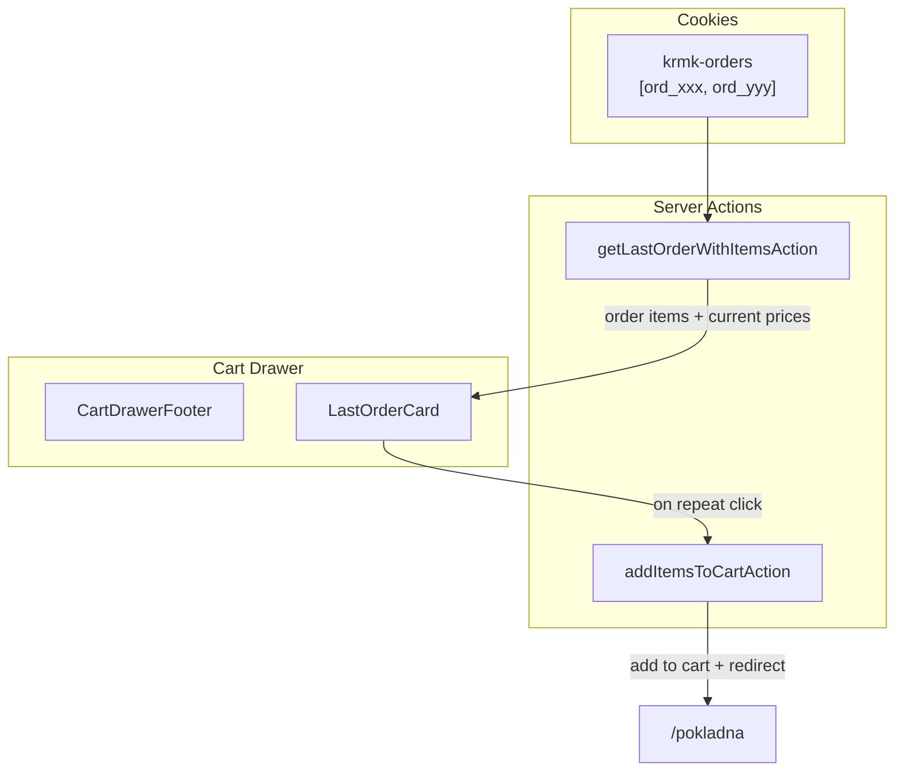

# Last Order Feature

## Architecture



## Implementation

### 1. Server Action: Fetch Last Order with Items

Add to [`src/features/checkout/actions.ts`](src/features/checkout/actions.ts):

```ts
export async function getLastOrderWithItemsAction() {
  const history = await getOrderHistory();
  if (history.length === 0) return null;

  const lastOrder = await db.query.orders.findFirst({
    where: inArray(orders.id, history),
    orderBy: [desc(orders.createdAt)],
    with: {
      items: {
        with: {
          product: {
            columns: { id: true, name: true, slug: true, priceCents: true, status: true },
            with: { image: { columns: { url: true } } },
          },
        },
      },
    },
  });
  // Return items with current prices, filtering out deleted/unavailable products
}
```

### 2. Server Action: Batch Add to Cart

Add to [`src/features/cart/actions.ts`](src/features/cart/actions.ts):

```ts
export async function addItemsToCart(items: { productId: string; qty: number }[]) {
  const cart = await getCart();
  // Merge items into cart, updating existing quantities
  await setCart(mergedCart);
  redirect("/pokladna");
}
```

### 3. UI Component: LastOrderCard

Create [`src/features/cart/components/last-order-card.tsx`](src/features/cart/components/last-order-card.tsx):

- Server component fetching last order data
- Shows first 2-3 items with thumbnails and names
- Displays "+N more" if more items exist
- Shows total at current prices
- "Zopakovať objednávku" button (form with server action)
- Hidden if no order history or all items unavailable

### 4. Integrate into Cart Drawer

Modify [`src/features/cart/components/cart-drawer-footer.tsx`](src/features/cart/components/cart-drawer-footer.tsx):

- Import and render `LastOrderCard` above the existing footer
- Wrap in Suspense for streaming

## Key Decisions

- **Current prices**: Use live product prices, not historical snapshot prices (user expectation)
- **Unavailable products**: Filter out deleted/draft products, show card only if 1+ items remain
- **Redirect**: Navigate to checkout after adding items (not just add to cart)
- **Slovak labels**: "Zopakovať objednávku", "Vaša posledná objednávka"

## Reference: Favorites "Add All" Pattern

The existing [`src/app/(public)/profil/oblubene/add-all-to-cart-button.tsx`](src/app/\\\\\(public)/profil/oblubene/add-all-to-cart-button.tsx) provides a similar pattern:

```ts
// Client component with useTransition for pending state
const [isPending, startTransition] = useTransition();

const handleAddAll = () => {
  startTransition(async () => {
    for (const productId of productIds) {
      await addToCart(productId, 1);
    }
    toast.success(`Pridaných ${count} produktov do košíka`);
  });
};
```

**Differences for Last Order feature:**

- Use a **batch server action** (`addItemsToCart`) instead of sequential calls (better performance)
- Include **redirect to checkout** via `redirect("/pokladna")` in the server action
- The button lives inside `LastOrderCard` (not a separate page)
- Add items with their **original quantities** from the order

## Documentation

Update [`docs/features/checkout.md`](docs/features/checkout.md) with:

- **Last Order Feature** section explaining:
  - How order history is tracked (`krmk-orders` cookie)
  - Where the card appears (cart drawer footer)
  - UX behavior (shows 2-3 items, current prices, repeat button)
  - What happens on repeat (batch add to cart + redirect to checkout)
  - Edge cases (unavailable products filtered out, card hidden if no valid items)