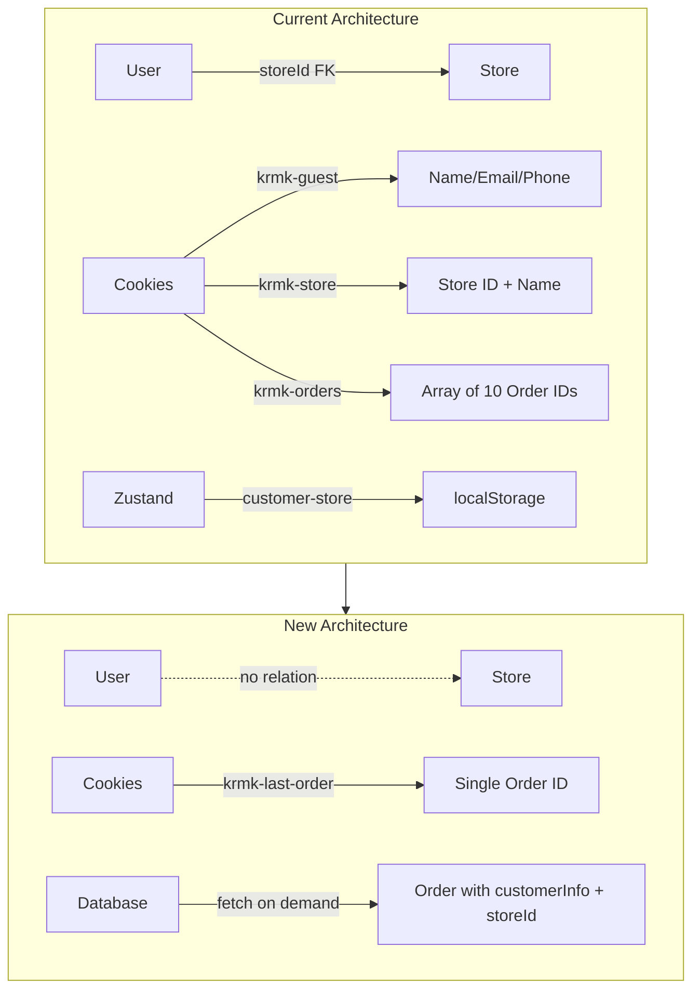
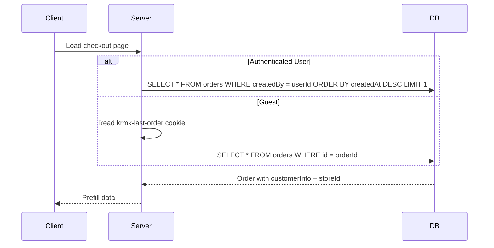

# Store Simplification Refactor

## Architecture Overview



## Data Flow for Checkout Prefill



---

## Phase 1: Database Schema Changes

### 1.1 Remove storeId from users table

**File:** [src/db/schema.ts](src/db/schema.ts)

Remove from `users` table:

```typescript
// DELETE these lines (48-50):
storeId: text("store_id").references(() => stores.id, {
  onDelete: "set null",
}),
```

Remove from `usersRelations`:

```typescript
// DELETE these lines (165-168):
store: one(stores, {
  fields: [users.storeId],
  references: [stores.id],
}),
```

Remove from `storesRelations`:

```typescript
// DELETE this line (902):
users: many(users),
```

### 1.2 Create migration

Run `pnpm drizzle-kit generate` to create migration, then manually verify the SQL drops the column safely.

---

## Phase 2: Auth/Session Updates

### 2.1 Remove storeId from Better Auth config

**File:** [src/lib/auth/server.ts](src/lib/auth/server.ts)

Remove `additionalFields.storeId`:

```typescript
// DELETE lines 42-47:
user: {
  additionalFields: {
    storeId: {
      type: "string",
      input: false,
    },
  },
},
```

### 2.2 Update getUserDetails query

**File:** [src/lib/auth/session.ts](src/lib/auth/session.ts)

Remove `store` relation from `getUserDetails`:

```typescript
// DELETE lines 32-38:
with: {
  store: {
    columns: {
      id: true,
      name: true,
      slug: true,
    },
  },
  // keep members...
}
```

---

## Phase 3: Cookie Simplification

### 3.1 Rewrite cookies.ts

**File:** [src/features/checkout/cookies.ts](src/features/checkout/cookies.ts)

Replace entire file with single-order-ID approach:

- Remove `GUEST_INFO_COOKIE` (`krmk-guest`)
- Remove `SELECTED_STORE_COOKIE` (`krmk-store`)
- Remove `ORDER_HISTORY_COOKIE` (`krmk-orders`)
- Add single `LAST_ORDER_COOKIE` (`krmk-last-order`)
- Keep only: `getLastOrderId()`, `setLastOrderId(orderId)`, `clearLastOrderId()`

---

## Phase 4: Checkout Actions Refactor

### 4.1 Simplify checkout actions

**File:** [src/features/checkout/actions.ts](src/features/checkout/actions.ts)

**Remove these functions:**

- `saveGuestInfoAction`
- `getGuestInfoAction`
- `clearGuestInfoAction`
- `saveSelectedStoreAction`
- `getSelectedStoreAction`
- `clearSelectedStoreAction`
- `getOrderHistoryAction`

**Rewrite `getLastOrderInfoAction`** to return both customerInfo AND storeId:

```typescript
type LastOrderPrefill = {
  customerInfo: { name: string; email: string; phone: string } | null;
  storeId: string | null;
};

export async function getLastOrderPrefillAction(
  userId?: string
): Promise<LastOrderPrefill | null> {
  // If authenticated: query by userId
  // If guest: read from krmk-last-order cookie
  // Return { customerInfo, storeId }
}
```

**Update `addOrderToHistoryAction`** → rename to `setLastOrderIdAction`:

```typescript
export async function setLastOrderIdAction(orderId: string): Promise<void>
```

### 4.2 Update order creation

**File:** [src/features/orders/actions.ts](src/features/orders/actions.ts)

In `createOrderFromCart`:

- Replace `addOrderToHistory(order.id)` with new `setLastOrderId(order.id)`
- Remove `clearGuestInfo()` call (no longer exists)

---

## Phase 5: Remove Client State

### 5.1 Delete Zustand store

**Delete files:**

- [src/store/customer-store.ts](src/store/customer-store.ts)
- [src/store/store-modal-state.ts](src/store/store-modal-state.ts)

### 5.2 Delete related components

**Delete files:**

- [src/components/customer-store-sync.tsx](src/components/customer-store-sync.tsx)
- [src/components/store-select-modal.tsx](src/components/store-select-modal.tsx)

### 5.3 Update header

**File:** [src/app/(public)/_components/header.tsx](src/app/\(public)/_components/header.tsx)

Remove:

- `CustomerStoreSync` component import and usage
- `getStores()` call (no longer needed in header)

### 5.4 Update layout

**File:** [src/app/(public)/layout.tsx](src/app/\(public)/layout.tsx)

Remove:

- `StoreSelectModal` component import and usage

---

## Phase 6: Checkout Form Updates

### 6.1 Update checkout page

**File:** [src/app/(public)/pokladna/page.tsx](src/app/\(public)/pokladna/page.tsx)

- Remove `guestInfo` prop
- Add `lastOrderPrefill` from new action
- Pass prefill data to form

### 6.2 Refactor checkout form

**File:** [src/features/checkout/components/checkout-form.tsx](src/features/checkout/components/checkout-form.tsx)

- Remove `useSelectedStore()` hook
- Remove `customerStore` prop
- Accept `lastOrderPrefill` prop instead
- Use prefill data for initial form values

### 6.3 Update use-checkout-form hook

**File:** [src/features/checkout/hooks/use-checkout-form.ts](src/features/checkout/hooks/use-checkout-form.ts)

- Remove `customerStore` parameter
- Remove `user?.storeId` logic
- Use `lastOrderPrefill.storeId` for initial store value
- Remove effect that syncs external store selection (lines 168-176)

### 6.4 Update customer info card

**File:** [src/features/checkout/components/customer-info-card.tsx](src/features/checkout/components/customer-info-card.tsx)

- Remove `guestInfo` prop
- Accept `lastOrderPrefill.customerInfo` for prefilling guest form
- Remove login modal trigger (or keep but simplify)

---

## Phase 7: User Profile Cleanup

### 7.1 Remove storeId from profile update

**File:** [src/lib/actions/user-profile.ts](src/lib/actions/user-profile.ts)

Remove `storeId` from `UpdateCurrentUserProfileInput` and update logic:

```typescript
// DELETE lines 13, 35-38:
storeId?: string;
// ...
if (input.storeId && !user.storeId) {
  updateData.storeId = input.storeId;
}
```

---

## Phase 8: Admin Updates

### 8.1 Remove users count from stores table

**File:** [src/components/tables/stores/columns.tsx](src/components/tables/stores/columns.tsx)

Delete the "customers" column definition (lines 140-159).

### 8.2 Update admin stores queries

**File:** [src/features/stores/queries.ts](src/features/stores/queries.ts)

Remove `users` relation from `getAdminStores` and `getAdminStoreById`:

```typescript
// DELETE these lines in both functions:
users: {
  columns: {
    id: true,
  },
},
```

### 8.3 Update admin user profile card

**File:** [src/app/(admin)/admin/users/[id]/_components/user-profile-card.tsx](src/app/(admin)/admin/users/[id]/_components/user-profile-card.tsx)

Remove `StoreSection` component and related code (lines 70, 216-228).

---

## Phase 9: Stores Actions Cleanup

**File:** [src/features/stores/actions.ts](src/features/stores/actions.ts)

Delete `updateUserStoreAction` function (lines 10-18) - no longer needed.

---

## Phase 10: Other Component Updates

### 10.1 Update UserButton

**File:** [src/components/user-button.tsx](src/components/user-button.tsx)

Remove store modal trigger:

- Remove `useStoreModalState` import
- Remove store selection menu item

### 10.2 Update cart drawer footer

**File:** [src/features/cart/components/cart-drawer-footer.tsx](src/features/cart/components/cart-drawer-footer.tsx)

Update to use new `getLastOrderWithItemsAction` that works with single order ID.

---

## Phase 11: Dashboard Queries

### 11.1 Audit dashboard metrics

**File:** [src/lib/queries/dashboard-metrics.ts](src/lib/queries/dashboard-metrics.ts)

- `getStoreDashboard` - uses `orders.storeId` which stays (orders still have storeId)
- `getStoreStats` - same, no changes needed

No changes needed - stores on orders remain, only user-store link is removed.

---

## Phase 12: Documentation Update

**File:** [docs/database-schema.md](docs/database-schema.md)

Update:

- Remove mention of `users.storeId` from Users section
- Remove `store: one(stores)` from Users relations
- Remove `users: many(users)` from Stores relations
- Update Entity Relationship Diagram (remove `Users → Stores` link)
- Add note about store being a content/pickup entity

**File:** [docs/features/checkout.md](docs/features/checkout.md)

Document new prefill behavior:

- Single order ID cookie for guests
- Last order query for authenticated users
- Prefill includes both customerInfo and storeId

---

## Migration Safety Notes

1. **Database migration**: The `store_id` column drop is safe - it's nullable and has `ON DELETE SET NULL`
2. **Cookie migration**: Old cookies will be ignored; new cookie name prevents conflicts
3. **No breaking changes for existing orders**: Orders keep their `storeId` reference
4. **Graceful degradation**: If no last order exists, checkout form starts empty (current behavior for new users)

---

## Files Summary

**Delete (7 files):**

- `src/store/customer-store.ts`
- `src/store/store-modal-state.ts`
- `src/components/customer-store-sync.tsx`
- `src/components/store-select-modal.tsx`
- `src/components/modal/login-modal.tsx` (if exists)
- `src/components/modal/store-select-modal.tsx` (if exists)

**Major refactor (5 files):**

- `src/db/schema.ts`
- `src/features/checkout/cookies.ts`
- `src/features/checkout/actions.ts`
- `src/features/checkout/hooks/use-checkout-form.ts`
- `src/features/checkout/components/checkout-form.tsx`

**Minor updates (10+ files):**

- Auth, session, profile, stores queries, admin components, header, layout, user-button, etc.