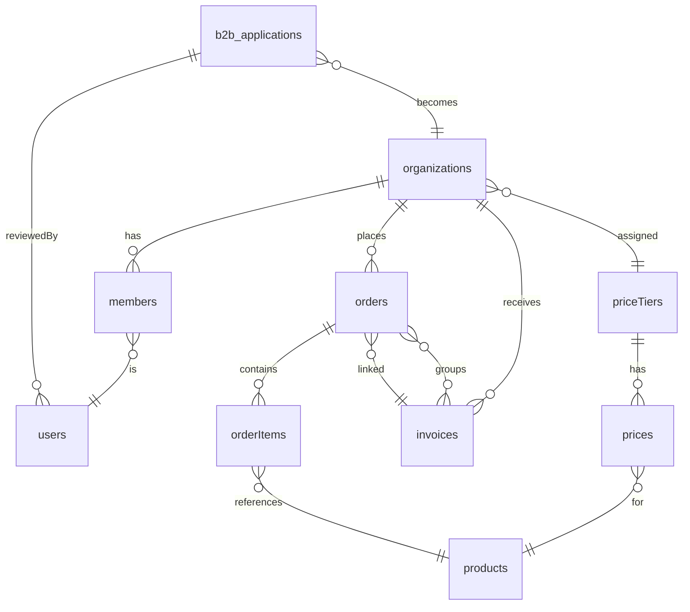
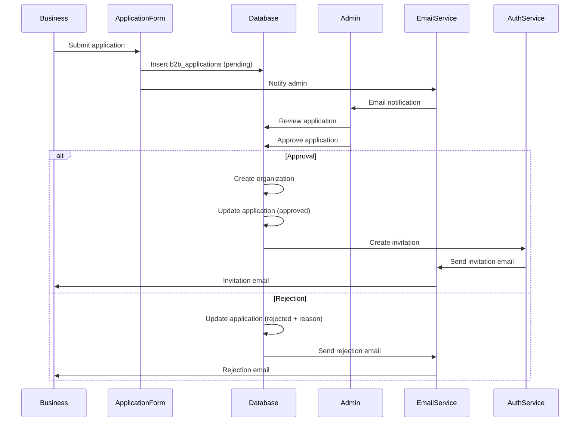
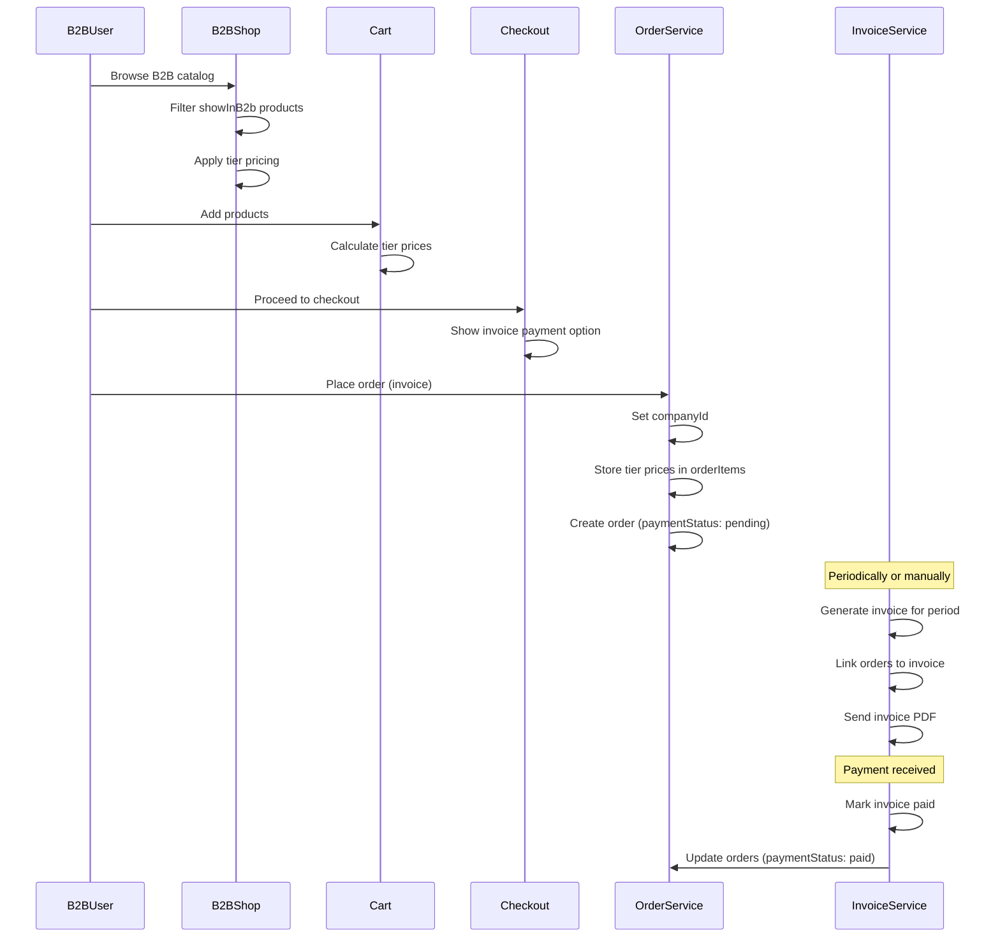
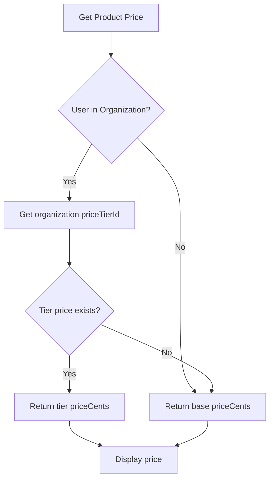
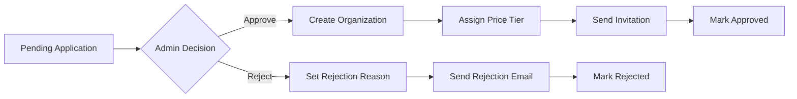
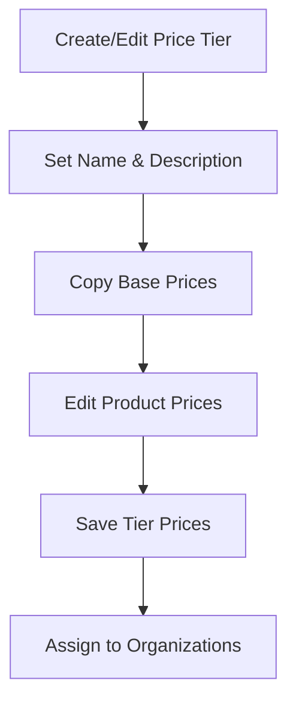
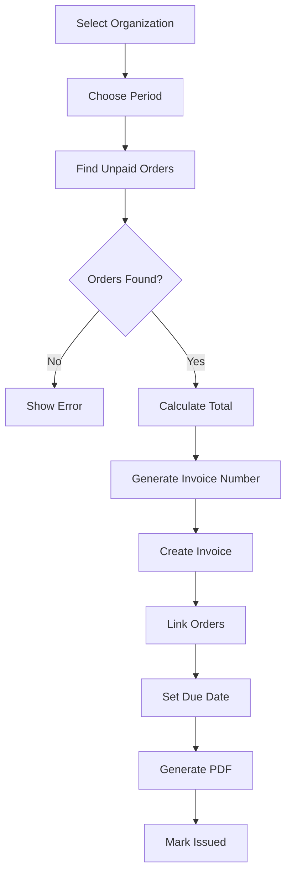

# B2B Architecture

System architecture, data flow, and component relationships for the B2B system.

## Entity Relationships



## Application Approval Flow



## B2B Order Flow



## Pricing Resolution



## Admin Workflows

### Application Review



### Price Tier Management



### Invoice Generation



## Component Structure

```
src/
├── app/
│   ├── (public)/
│   │   └── b2b/
│   │       ├── page.tsx              # Landing page
│   │       ├── apply/
│   │       │   └── page.tsx          # Application form
│   │       └── shop/
│   │           └── page.tsx          # B2B catalog
│   └── (admin)/
│       └── admin/
│           └── b2b/
│               ├── applications/      # Application management
│               ├── clients/          # Organization management
│               ├── price-tiers/      # Price tier management
│               └── invoices/         # Invoice management
├── features/
│   └── b2b/
│       ├── applications/             # Application queries/actions
│       ├── clients/                  # Organization queries/actions
│       ├── price-tiers/             # Price tier queries/actions
│       └── invoices/                # Invoice queries/actions
├── lib/
│   └── pricing.ts                   # Pricing utilities
└── validation/
    └── b2b.ts                       # B2B validation schemas
```
